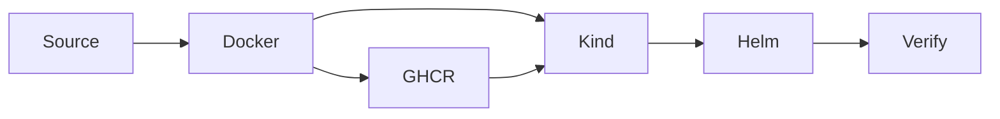

# Local Kubernetes Delivery

This repository contains a local-first implementation of the original
[test assignment](TASK.md).

## What Is Implemented

- A dependency-free Python HTTP service with health, readiness, metrics, build
  information, structured logs, and graceful shutdown.
- A non-root container image with build version and commit metadata.
- A local kind cluster named `interview-dev`.
- A Helm deployment with two replicas, probes, resource limits, a rolling
  update strategy, and a restricted container security context.
- A runtime check for endpoints, probes, rolling updates, and graceful
  shutdown.
- Local environment checks, unit tests, and pre-commit validation.
- CI validation of the full deployment path in a temporary kind cluster.
- SemVer releases published to GitHub Container Registry.

## Architecture



The Python application can be built into a local Docker image or pulled as a
released image from GHCR.
Kind runs an isolated Kubernetes cluster on the developer machine.
The selected image is loaded directly into kind.
Helm installs and upgrades the application in the `interview` namespace.
A ClusterIP Service exposes the application inside the cluster.
Kubernetes probes and a two-replica rolling strategy maintain availability.
The Makefile provides the same entry points intended for later CI automation.

## Quick Start

Prerequisites are listed in [developer setup](docs/developer-setup.md).

```shell
make setup
make check
make check-env
make e2e
```

Deploy and verify a released image from GHCR:

```shell
make release-delivery RELEASE_VERSION=0.1.0
```

If the package is private, authenticate Docker first:

```shell
echo "$GHCR_TOKEN" | docker login ghcr.io -u USERNAME --password-stdin
```

Remove the local cluster when finished:

```shell
make clean-cluster
```

## Main Commands

| Command | Purpose |
| --- | --- |
| `make install` | Install project-local development dependencies |
| `make setup` | Create the virtual environment and install Git hooks |
| `make check` | Run lint and unit tests |
| `make test` | Run application and tooling tests |
| `make chart` | Validate the Helm chart |
| `make check-env` | Check the complete Docker and Kubernetes toolchain |
| `make e2e` | Validate the toolchain and run local delivery |
| `make image` | Build the local container image |
| `make pull-release` | Pull a released image from GHCR |
| `make cluster` | Create the kind cluster |
| `make deploy-built` | Load and deploy an existing application image |
| `make deploy` | Build, load, and deploy the application |
| `make deploy-release` | Pull and deploy a released image from GHCR |
| `make verify-local` | Run runtime verification |
| `make local-delivery` | Build, deploy, and verify without tool checks |
| `make release-delivery` | Deploy and verify a released GHCR image |
| `make clean-cluster` | Delete the kind cluster |

## Release Model

Local builds use `APP_VERSION`, `COMMIT_SHA`, and an image tag passed through
the Makefile. Pull requests and pushes to `main` run checks, build the image,
validate the chart, and verify a deployment in a temporary kind cluster.

A stable Semantic Versioning tag such as `v1.2.0` publishes one image to
`ghcr.io/<owner>/<repository>`. The image receives the tags `1.2.0` and
`sha-<short-commit>`, which point to the same digest. Release tags must point
to commits from `main`; a `latest` tag is never published.

## Review Tasks

The original [shell script](review/script.sh) and
[Kubernetes manifest](review/nginx.yaml) are kept unchanged with a
[written review](review/README.md).

## Known Limitations

- The Helm chart is not yet published as an OCI artifact.
- The setup is intended for local development, not production.
- There is no ingress, TLS, authentication, monitoring stack, or persistent
  storage.
